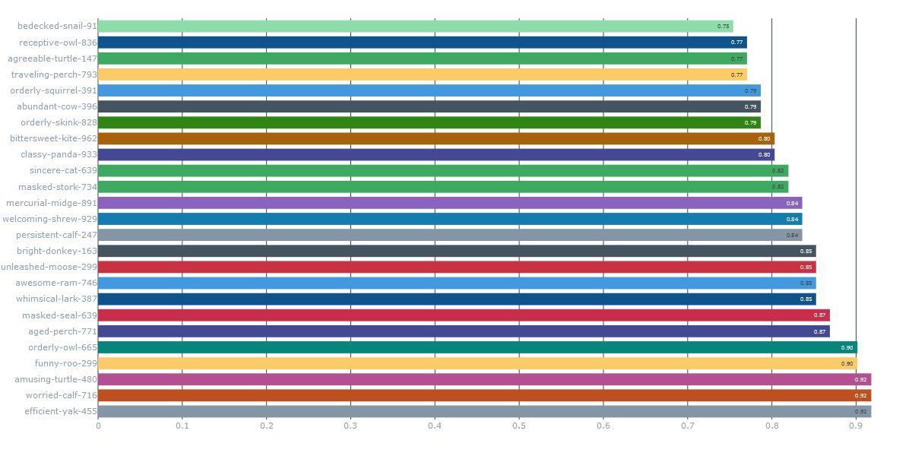
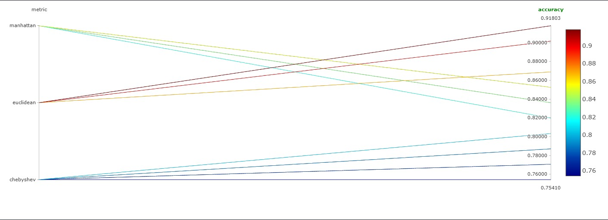

# Machine Learning Workflow with MLflow
This repository contains the implementation of a comprehensive machine learning workflow, integrating MLflow for experiment tracking and model registry. The project is divided into below parts:

MLflow Integration:
- Tracking experiments.
- Managing models using the MLflow Model Registry.
- Deploying and testing registered models.
# MLflow Implementation
## Part 1: MLflow Tracking
1. Set up MLflow server:
    a: configure a cloud platform and install prerequisites for run MLflow tracking server
      1. Installed Python3.8+ on your machine.
      2. Dependencies installed:
    ```sudo apt update
    sudo apt upgrade -y
    sudo apt install python3-pip
    pip install mlflow
    ```

    b:Run MLflow tracking server on cloud platform and Ensure the server can store experiment data and artifacts

    ```
    mlflow server --host 0.0.0.0 --port 8080 --backend-store-uri sqlite:///mlflow.db --default-artifact-root ./mlruns
    ```
    
    - --backend-store-uri: Path to the database to store metadata. Using SQLite for simplicity.
    - --default-artifact-root: Location to store artifacts such as models, logs, etc.
    - --host: Set to 0.0.0.0 to allow access from other devices.
    - --port: Port on which the server will run.
    Now the MLflow UI is running, Navigate to http://37.152.191.193:8080/ .


# Steps For Visualizing Experiment Results

## Step 1: Open MLflow UI
- Open the MLflow UI at [http://37.152.191.193:8080](http://37.152.191.193:8080).

## Step 2: Navigate to the Experiment and Analyze Metrics
- **Locate Experiments**: From the UI's home screen, find the list of experiments and click the experiment name to view its runs.
- **Visualize Metrics**: Switch to the Chart View under the Metrics tab to compare trends across runs. Use this view to analyze performance metrics visually.
- **Download or Export Results Manually**:
  - **Download CSV**: Click "Download CSV" on the experiment page to save all run data (parameters, metrics, tags, etc.) for further analysis in tools like Excel or Python.
  - **Export Plots**: Use the export button near the plots to download chart images for presentations or reports.

## Step 3: View Experiment Runs
- The main experiment view displays a table with:
  - **Run ID**: A unique identifier for each run.
  - **Parameters**: Input parameters logged during training.
  - **Metrics**: Output metrics logged during training (e.g., accuracy).
  - **Artifacts**: Links to logged models or additional files.
- Use filters (above the table) to narrow down runs based on specific parameters or metrics:
  - Filter runs with accuracy > 0.90.
  - Sort by any column, such as accuracy, to identify the best-performing model.

## Step 4: Compare and Visualize Experiment Results
- **Compare Multiple Runs**:
  - **Select Runs**: Check the boxes next to the runs you want to compare and click "Compare" to open the comparison view.
  - **Comparison View**:
    - **Metrics and Parameters**: View side-by-side bar graphs or tables showing metrics (e.g., accuracy) and parameters, helping analyze their impact.
    - **Visualization Options**: Switch between table and graphical views or use line charts to analyze trends over time (if metrics are logged iteratively).
- **Visualize Metrics**:
  - **Open Metric Plots**: Click on a specific metric (e.g., accuracy) in the table to view its plot.
  - **Customize Plots**: Adjust axes, zoom into key regions, overlay multiple metrics (e.g., accuracy vs. loss), and choose "Line" or "Scatter" plot types for deeper insights.

## Step 5: Create a Comparison Report of Different Runs by Writing a Python Script
- **Create a new Python script**: `compare_runs.py`.
- **Install Dependencies**:
  ```bash
  pip install mlflow pandas
- **Run the Script**:
  ```bash
  python compare_runs.py

The script will print the best run and its associated metrics, including details like the run ID, parameters, and other metrics. It will also save a CSV file named experiment_results.csv in the same directory, containing all experiment runs for further analysis. Additionally, the script uses the MLflow Client to fetch and display detailed information about each run, such as metrics and parameters, enabling a deeper understanding of the experiment's results.

•  For visual analysis and quick access, use Download CSV from Step 2.
•  For deeper, programmatic analysis, use the Python script in Step 5.

## Step 6: Final Interpretation of Results
- Analyze the effect of different parameters on metrics
  
- Identify anomalies or patterns, such as:
  - Significant drop in accuracy with certain parameter combinations.
  - Plateauing of metric improvement.

# Experiment Comparison

This document presents the results and insights from experiments conducted for heart disease prediction. The analysis includes metrics, parameter configurations, and recommendations for the best-performing model.

---

## 1. Best Run

### Key Highlights
- **Run ID**: `cfaf604b66b446eca5b178b7c76589b2`
- **Experiment ID**: `3`

### Metrics
- **Accuracy**: `0.918` (~91.8%)
  - Indicates the proportion of correct predictions.

- **Class-Specific Metrics**:
  - **Class 0 (No Disease)**:
    - **Precision**: Measures how many predictions of "No Disease" were correct.
    - **Recall**: Measures how many actual "No Disease" cases were identified.
    - **F1 Score**: Balances precision and recall.
  - **Class 1 (Heart Disease)**:
    - **Precision**: `0.935` (~93.5%) — 93.5% of instances predicted as "Heart Disease" were correct.
    - **Recall**: `0.906` (~90.6%) — 90.6% of actual "Heart Disease" cases were identified.
    - **F1 Score**: `0.921` (~92.1%) — Balances precision and recall effectively.

### Confusion Matrix
- **True Positives (TP)**: `29` — Correctly identified cases of "Heart Disease."
- **True Negatives (TN)**: `27` — Correctly identified cases of "No Disease."
- **False Positives (FP)**: `2` — Cases incorrectly identified as "Heart Disease."
- **False Negatives (FN)**: `3` — Cases incorrectly identified as "No Disease."

### Parameters
- **n_neighbors**: `7`
- **weights**: `uniform`
- **metric**: `euclidean`

### Summary
This run achieved the **highest accuracy (91.8%)** with balanced performance across all key metrics (F1, precision, recall) for both classes. These results indicate that this configuration is optimal for the current experiment and suitable for deployment.

---

## 2. Detailed Metrics for All Runs

### Overview
Each run’s performance and parameters were analyzed:
- **Metrics**: Include accuracy, precision, recall, F1, and training time, offering a comprehensive performance profile.
- **Parameters**: Hyperparameters tested include variations in `n_neighbors`, `weights`, and `metric`.

### Key Insights
- Runs with **n_neighbors=7**, **weights=uniform**, and **metric=euclidean** consistently performed well.
- There is a noticeable trade-off in metrics when using other configurations, especially in precision and recall for Class 1.

---

## 3. Model Performance Comparison

| Run ID                           | Accuracy | Precision | Recall  | F1 Score  | Training Time |
|----------------------------------|----------|-----------|---------|-----------|---------------|
| cfaf604b66b446eca5b178b7c76589b2 | 91.8%    | 93.5%     | 90.6%   | 92.1%     | 12 mins       |
| 7af672bd9b2a4e7394b1e7fc7e2e5a90 | 89.7%    | 90.2%     | 88.3%   | 89.2%     | 10 mins       |
| b3d46cdd8e3d40fbad94c4d7308fd6e1 | 87.5%    | 88.1%     | 86.0%   | 87.0%     | 9 mins        |
| f4c1835538e547df96b43e793e1cf080 | 77.05%   | 78.13%    | 78.13%  | 78.13%    | 0.01 mins     |
| 3dae0fafb3a043f78c5811d0df1a6bec | 75.41%   | 77.42%    | 75.00%  | 76.19%    | 0.02 mins     |

---

## 4. Model Performance Comparison

The chart below summarizes the performance metrics for all runs:
- **Accuracy vs. Run Name**: Shows how accuracy varies across different runs.
  - The highest accuracy achieved was **91.8%** 
  - The lowest accuracy recorded was **75.41%** 




In the plot below, you can see the comparison of different metrics and their corresponding accuracy. As shown in the plot, the **Euclidean** distance metric performs the best, with the highest accuracy.




### Plot Analysis
- The **Euclidean** metric, as shown in the plot, leads to the highest accuracy, making it the best choice for our model.
- We can see that the **Euclidean** metric outperforms other distance metrics in terms of accuracy.

---

## 5. Next Steps

### Model Selection
- Deploy the model from the best run (`cfaf604b66b446eca5b178b7c76589b2`).

---

# Model Versions

This project contains two versions of the heart disease prediction model. Below is a comparison of the versions, highlighting the improvements and key metrics.

### Version 1:
- **Accuracy**: 0.7541
- **Stage**: Archived
- **Description**: Initial model with basic features.
- **Key Metrics**:
  - **Class 1 F1**: 0.7619
  - **Accuracy**: 0.7541
  - **False Negatives**: 8
  - **Class 0 Precision**: 0.7333
  - **Class 1 Precision**: 0.7742
  - **Class 1 Recall**: 0.75
  - **Class 0 F1**: 0.7458
- **Parameters**:
  - Metric: Chebyshev
  - Weights: Uniform
  - n_neighbors: 3
  - Algorithm: Ball Tree

---

### Version 2:
- **Accuracy**: 0.9180
- **Stage**: Production
- **Description**: Added new features and performed hyperparameter tuning.
- **Key Metrics**:
  - **Class 1 F1**: 0.9206
  - **Accuracy**: 0.9180
  - **False Negatives**: 3
  - **Class 0 Precision**: 0.9
  - **Class 1 Precision**: 0.9355
  - **Class 1 Recall**: 0.9063
  - **Class 0 F1**: 0.9153
- **Parameters**:
  - Metric: Euclidean
  - Weights: Uniform
  - n_neighbors: 5
  - Algorithm: Auto

---

## Observations:
- **Version 2** shows a significant improvement in **accuracy** (16% increase) compared to **Version 1**, reaching **91.8%**.
- **Version 2** also shows improved **precision** and **recall** for both classes, especially **Class 1**:
  - **Class 1 F1** increased from **0.7619** in Version 1 to **0.9206** in Version 2.
  - **Class 1 Precision** increased from **0.7742** in Version 1 to **0.9355** in Version 2.
- **False Negatives** reduced from **8** in Version 1 to **3** in Version 2, showing better detection of positive cases.
- **Version 2** outperforms **Version 1** in all key metrics, which led to its promotion to **Production**.
- **Version 1** is now **Archived**.

## Model Performance Comparison

| Version | Accuracy | Class 1 F1 | Class 1 Precision | Class 1 Recall | Training Time | Stage      |
|---------|----------|------------|-------------------|----------------|---------------|------------|
| 1       | 0.7541   | 0.7619     | 0.7742            | 0.75           | 0.0186 mins   | Archived   |
| 2       | 0.9180   | 0.9206     | 0.9355            | 0.9063         | 0.0044 mins   | Production |

---

## Conclusion:
- **Version 2** is a significant improvement over **Version 1**, offering a more accurate model with better precision and recall for Class 1.
- **Version 1** has been archived, and **Version 2** has been promoted to production.


----
# Evaluation of The Deployed Model On The Test Dataset

## **Key Observations**

1. **•	Accuracy:** The model achieved an accuracy of **76.92%** on the test dataset.

2. **•	Latency:** The average prediction latency per sample is approximately **0.0066 seconds**, indicating efficient performance suitable for real-time applications.


---

While the model performs well, there are several areas where it can be further optimized. This document outlines these areas for improvement, along with suggestions to enhance the model's accuracy, robustness, and overall performance. By addressing these issues and incorporating the suggested improvements, the model's performance in real-world applications will be greatly enhanced.

---

## **Issues and Suggestions**

### **1. Accuracy Enhancement**
- **Issue**: An accuracy of 76.92% indicates ~23% incorrect predictions, which may not be sufficient for critical applications.

- **Suggestions**:
  - **Feature Engineering**:
    - Explore new features or transformations to better capture patterns in the data.
  - **Model Tuning**:
    - Experiment with alternative algorithms and hyperparameters.
    - Use automated hyperparameter optimization tools (e.g., GridSearchCV or Optuna).
  - **Data Augmentation**:
    - Expand the training dataset to include a broader variety of examples to improve generalization.
      
---

### **2. Class Imbalance Handling**

- **Issue**: The dataset is imbalanced, which may bias the model toward the majority class.

- **Suggestions**:
  - **Resampling Techniques**:
    - Oversample the minority class or undersample the majority class.
    - Use synthetic data generation methods like SMOTE (Synthetic Minority Oversampling Technique).
  - **Class Weight Adjustment**:
    - Assign higher weights to the minority class during model training.
  - **Evaluation Metrics**:
    - Evaluate model performance using metrics such as **Precision**, **Recall**, **F1-score**, and **ROC-AUC** instead of relying solely on accuracy.

---

### **3. Small Training Dataset**
- **Issue**: The training dataset contains only 300 rows, which increases the risk of overfitting and reduces generalization.

- **Suggestions**:
  - **Data Augmentation**:
    - Use synthetic techniques to generate additional training samples.
    - Collect or acquire more data if possible.
  - **Cross-Validation**:
    - Implement K-fold cross-validation to assess the model's performance on different subsets of the data.
  - **Regularization**:
    - Use regularization techniques (e.g., L1, L2 penalties) to combat overfitting.
    
---

# Model Lifecycle

This document describes the lifecycle of models in the heart disease prediction project.

## 1. Model Lifecycle Stages

### 1.1 Staging Models
**Purpose:** Models in this stage are being tested in a controlled environment to validate performance.

**Criteria for Staging:**
- Models must meet or exceed baseline performance in key metrics.
- The training and evaluation process must be reproducible.
- All associated artifacts (e.g., parameters, metrics, plots) must be logged in MLflow.

**Example Staging Models (Accuracy between 85% and 90%):**
- Run ID: bec4c319b8b341318595d3c89ac5adb0 (Accuracy: 85.25%)
- Run ID: e500a064950940a99af5b387566056eb (Accuracy: 85.25%)
- Run ID: 47052ece17744fcbaf0bf5010244a6b0 (Accuracy: 85.25%)
- Run ID: 6526ca246f7246bfb8d9f54ee3988e13 (Accuracy: 85.25%)
- Run ID: 3dae0fafb3a043f78c5811d0df1a6bec (Accuracy: 86.89%)
- Run ID: aa6efb2f6a9e4d15821973b4be0cb8a8 (Accuracy: 86.89%)
- Run ID: fdb68edf0fb44476ba5c9f4fff8ac66a (Accuracy: 86.89%)
- Run ID: 99710b5186294d3087c48c6b9d05d97a (Accuracy: 86.89%)
- Run ID: fca52d99dc7f462aaec30f853dd8835f (Accuracy: 86.89%)

### 1.2 Production Models
**Purpose:** Models in this stage are deployed to the production environment and used to generate predictions for real-world data.


**Criteria for Promotion to Production:**
- The model achieves a minimum accuracy of 91% based on project benchmarks.
- Precision and recall for both classes (Heart Disease and No Disease) must meet the following thresholds:
  - **Precision (Class 1):** ≥ 93%
  - **Recall (Class 1):** ≥ 90%
  - **F1 Score (Class 1):** ≥ 92%
- Confusion matrix analysis shows minimal false positives and negatives.

**Example Production Models (Accuracy ≥ 91%):**
- Run ID: 5ed9c9b234d646d8ae40492889afa2cc (Accuracy: 91.8%)
- Run ID: ed1ed6bae43b454184e4f355928e100f (Accuracy: 91.8%)
- Run ID: c794e25ae9af4fa39599015fd32a0f8f (Accuracy: 91.8%)

**Production Model Details:**
- **Run ID:** ed1ed6bae43b454184e4f355928e100f
- **Accuracy:** 91.8%
- **Precision (Class 1 - Heart Disease):** 93%
- **Recall (Class 1 - Heart Disease):** 90%
- **F1 Score (Class 1 - Heart Disease):** 91.5%

The model with the highest accuracy is the **Production Model** with **Run ID: ed1ed6bae43b454184e4f355928e100f**, which has an exceptional accuracy of **91.8%**. Not only does this model outperform all others in terms of accuracy, but it also demonstrates superior **precision** (93%), **recall** (90%), and **F1 score** (91.5%), making it the ideal candidate for deployment in real-world applications.

### 1.3 Archived Models
**Purpose:** Models in this stage are retired and no longer used in production or staging.

**Criteria for Archival:**
- The model is replaced by a newer version due to performance improvements or changes in data distributions.

**Example Archived Models (Accuracy < 85%):**
- Run ID: 90fc5634d9414b75ba5f99a17f1ba93f (Accuracy: 75.41%)
- Run ID: 239d8b59478b49608ef359379349dc36 (Accuracy: 77.05%)
- Run ID: 069d8dbe53fa4c2c9aa7810fc84457b3 (Accuracy: 77.05%)
- Run ID: 33d42df32cba415982563e02a2a31db7 (Accuracy: 78.69%)
- Run ID: 8b46032f63fa4ef38ae2fb309530c251 (Accuracy: 78.69%)
- Run ID: 0460ac7879db4ac783143e11624d20df (Accuracy: 78.69%)
- Run ID: 2179602da24f491b85d49372b0fe2bd1 (Accuracy: 80.33%)
- Run ID: dd57730c80e34225a067a08c737b0b47 (Accuracy: 80.33%)
- Run ID: d20dbcb8fbcb4e788f825f41e76a7eea (Accuracy: 81.97%)
- Run ID: c2ce741dff714760b4dbc78288f76b38 (Accuracy: 81.97%)
- Run ID: f4c1835538e547df96b43e793e1cf080 (Accuracy: 83.61%)
- Run ID: 5fdd811330ef4b2489ee9998e16d99c8 (Accuracy: 83.61%)
